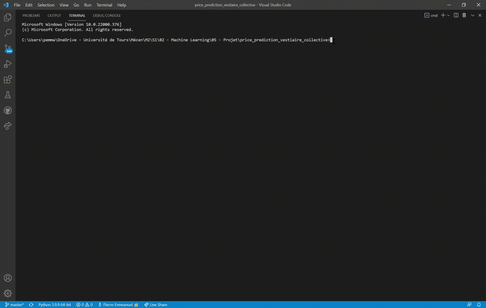
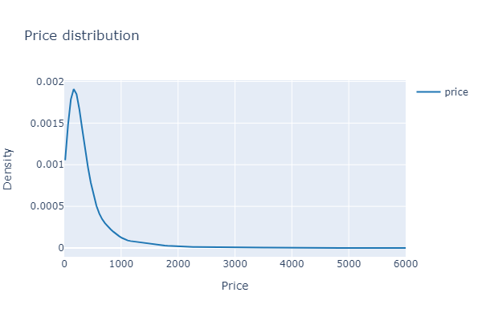
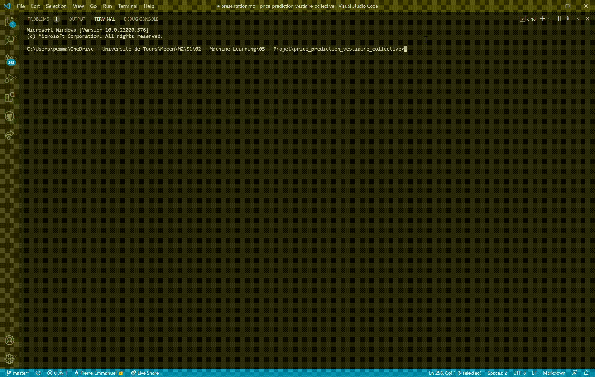
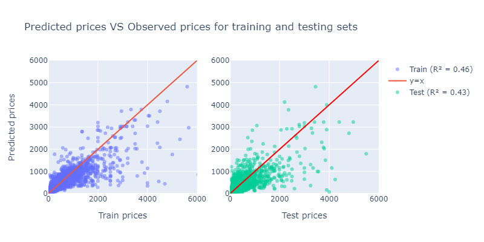

# Decision Support for Pricing of Second-Hand Items

## Introduction

<br/>

### Vestiaire Collective

[Vestiaire Collective](https://fr.vestiairecollective.com/) is a platform on which second-hand fashion items are traded. Its objective is to connect sellers and buyers while certifying the authenticity of the products offered by the sellers. This platform allows to remove the problem of asymetric information related to the sale of luxury products. 

<br/>

### Objectif du projet

Implement a machine learning algorithm to **estimate the price of a second-hand luxury item** in order to help users set the "right" price when they put an item on sale on the Vestiaire Collective platform.

<br/>

### Motivations

The algorithm's prediction allows sellers to avoid wasting time in setting the price. This decision support helps him to maximize his profits by preventing him from selling at too low a price or not finding buyers because his price is too high.

Besides, the algorithm allows buyers to find items sold at a price close to their willingness to pay by encouraging sellers to set the "right" price.

For Vestiaire Collective, the price prediction tool ensures the volume and speed of transactions. The more transactions, the more commissions the platform earns. It also enhances user satisfaction: buyers find items that are priced to generate a surplus and sellers save time selling their items. 

<br/>

### Méthode 

1. Data collection from Vestiaire Collective [website](https://fr.vestiairecollective.com/)

2. Data cleaning and feature engineering to build a reliable data set

3. Model training and parameter tuning

4. Model selection and decision-making

<br/>

## Collecte des données

<br/>

### Méthode

Selection of the **35 first brands** from the (https://fr.vestiairecollective.com/marques/) section

Implementation of a python library `vc_scraping` to collect data and create the data set:
- Saving the **10 first pages** of articles for each brand and the web pages of each article in serializable dataclasses
- Identification and storage of each item's characteristics (price, brand, number of *likes*, etc.) in serializable dataclasses

Example with `python -m vc_scraping`

<br/>



<br/>

### Data description

Data set obtained after the scraping and parsing stages via the `make_dataset` function of the `vc_scraping` library

| Variable   |      Type      | Description    |
|:-|:-|:-|
| `id`         |  int        | Numéro d'identification de l'article              | 
| `url`        |   string    | Lien de la page web de l'article          | 
| `num_likes`   | int  | Nombre de *likes* reçu par l'article
| `price` | float | Prix |
| `we_love_tag` | bool | Indique si l'article est un coup de coeur de Vestiaire Collective |
| `online_date` | datetime | Date de mise en ligne |
| `gender` | bool | Genre (homme, femme, enfant) | 
| `category` | category | Catégorie (chaussures, vêtement, accessoires, etc.) | 
|  `sub_category` | category | Sous-catégorie (baskets, chemises, jeans, etc.) | 
| `designer` | category | Marque de l'article | 
| `condition` | category | Etat de l'article |
| `material` | category | Matériaux composant l'article | 
| `color` | category | Couleur | 
| `size` | category | Taille (M, L, 40, etc.) | 
| `location` | category | Localisation du vendeur | 

<br/>

## Data analysis and cleaning

<br/>

### Visualisation de la variable cible `price`

<br/>



<br/>

### Nettoyage des données

- Suppression des catégories peu représentées dans chaque variable
- Traitement de la variable `size` : 

  - Echelle "S, M, L" pour les vêtements
  - Echelle "36, 40, 44" pour les chaussures

- Transformation des variables catégorielles en variables binaires avec la fonction `pd.get_dummies`

<br/>

## Implémentation des modèles de régression via `sklearn`


<br/>

### Objectif & Méthode

**Objectif** : identifier un modèle expliquant au mieux la relation entre le prix d'un article et ses caractéristiques

**Méthode** : création d'une librairie `vc_ml` pour entrainer des modèles de *machine learning* de manière automatique et choisir l'estimateur le plus adapté aux données

<br/>

### Présentation de la librairie `vc_ml`

- `data.py` : créer les échantillons d'apprentissage et test
- `estimators.py` : définir les estimateurs sous forme de dataclasses
- `config.py` : configuration des modèles à entrainer avec pour chaque modèle la grille de paramètres à tester
- `training.py` 
  - Classe d'entrainement d'un modèle et de ses paramètres
  - Fonction pour entrainer plusieurs modèles
- `selection.py` : fonctions pour la sélection du meilleur modèle

<br/>

### Apprentissage automatisé

Chaque estimateur est une dataclass sérialisable dont les arguments sont les paramètres associés à l'estimateur

Les estimateurs sont stockés dans un fichier de configuration au format `yaml` via la dataclass `Config`

Exemple pour la configuration d'un modèle de type `GradientBoostingRegressor`

```
In [1]: from vc_ml import load_config
In [2]: config = load_config(file_name="config_gb.yaml")
In [3]: config
Out[3]: Config(lr=None, ridge=None, tree=None, rf=None, gb=GBEstimator(n_estimators=[250, 500, 750, 1000], ...), mlp=None)

```

Utilisation de la classe `ModelTraining` pour : 

- Créer une *pipeline* avec possibilité d'effectuer une ACP sur la matrice des variables explicatives 
- Entrainer un estimateur pour une combinaison de paramètres donnée via cross-validation
- Sauvegarder le modèle entrainé en lui attribuant un nom unique et identifiable

Utilisation de la fonction `train_models` pour entrainer plusieurs modèles avec pour chaque modèle, différentes combinaisons de paramètres à tester

La fonction permet aussi de spécifier une liste de valeurs à tester pour l'argument `n_components` de la classe `PCA`

Exemple en ligne de commande via `python -m vc_ml` 

<br/>



<br/>

## Choix du meilleur modèle


<br/>

### Méthode

- Récupération des modèles et des scores stockés dans un dossier backup à l'aide de la fonction `get_cv_results`
- Identification du meilleur modèle par la fonction `get_best_estimator` avec 3 critères possibles : 

  - Score d'entrainement
  - Score de test
  - Score moyen 

$\rightarrow$ `GradientBoostingRegressor` sans ACP préalable

<br/>

### Paramètres du `GradientBoostingRegressor`

- `n_estimators` : 250
- `max_depth` : 10
- `min_samples_split` : 20
- `min_samples_leaf` : 5
- `learning_rate` : 0.1
- `loss` : "huber"
- `criterion` : "squared_error"

<br/>

### Visualisation des résultats du `GradientBoostingRegressor`

<br/>



<br/>

### Apport du *machine learning*

- Augmentation significative du score en test entre `GradientBoostingRegressor` et modèle de base tel que le `DummyRegressor` (prédiction par la moyenne) : **on passe de 0 à 0.43** 
<br/>
- Cependant, **seulement 43% de la variabilité des prix est expliquée par les variables explicatives utilisées dans le modèle**
<br/>
- Difficulté à prédire les articles à prix élevé 

<br/>

## Conclusion sur le projet


<br/>

### Apports techniques

- Collecter des informations de manière quasiment automatique sur Vestiaire Collective
- Automatiser l'entrainement de modèles de régression, leur sauvegarde et le choix du meilleur estimateur

<br/>

### Apport business

Identification d'un modèle pouvant être utilisé en **aide à la décision** pour la fixation du prix mais restreint dans sa capacité à déterminer le "bon" prix

<br/>

### Axes d'amélioration

- Collecter plus d'articles pour améliorer la force de prédiction des modèles entrainés
- Entrainer des modèles plus avancés tels que des algorithmes de *deep learning*
- Créer un **interface graphique** (GUI ou CLI) permettant à l'utilisateur d'entrer les caractéristiques de son article pour lui renvoyer ensuite un prix estimé et des annonces similaires