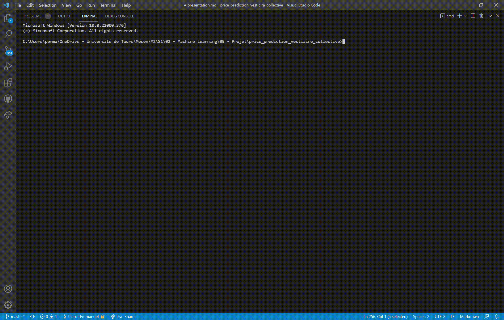
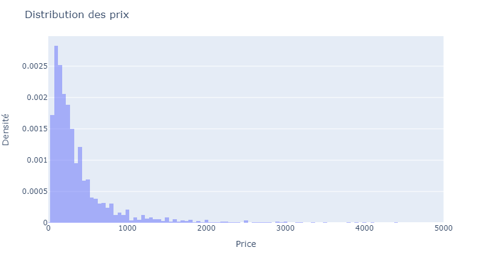
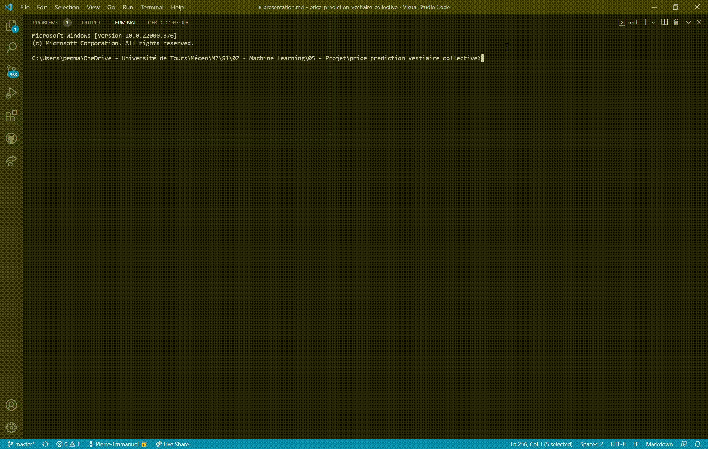
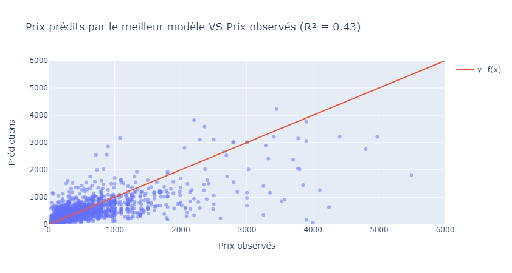

# Peut-on prédire le prix d'un article de luxe ?

--- 

## Vestiaire Collective 

<br/>

- Plateforme digitale du luxe de seconde main
<br/>
- Mise en relation de vendeurs et de potentiels acheteurs
<br/>
- Certification de l'authenticité des articles mis en vente $\rightarrow$ réduction du problème d'asymétrie d'information 

---

## Objectif du projet

<br/>

Implémenter un algorithme de *machine learning* permettant d'**estimer le prix d'un article de luxe de seconde main** afin d'aider les utilisateurs à fixer le "bon" prix lorsqu'ils mettent en vente un article sur la plateforme Vestiaire Collective

---

## Motivations

| Vendeur   |      Acheteur      | Vestiaire Collective    |
|:---------- |:------------- |:------------- |
|Gain de temps |  Trouver des articles vendus à un prix proche de leur disposition à payer   | Augmenter le volume de transactions            | 
|Minimiser le risque de vendre à un prix trop bas/élevé  |    | Satisfaction des utilisateurs     | 

---

## Méthode 

1. Collecte des données depuis le [site](https://fr.vestiairecollective.com/) de Vestiaire Collective
<br/>

2. Nettoyage des données et *feature engineering* pour construire une base de données fiable et utilisable
<br/>

3. Entrainement et optimisation d'algorithmes de *machine learning*
<br/>

4. Choix du meilleur modèle et prise de décision

--- 

## Etape 1 - Collecte des données

Sélection des **35 premières marques** de la rubrique [Notre Sélection](https://fr.vestiairecollective.com/marques/) 

Création d'une librairie python `vc_scraping` pour créer la base de données :
- Sauvegarde des **10 premières pages** d'articles pour chaque marque et des pages web de chaque article dans des dataclasses sérializables
- Identification et stockage des caractéristiques (prix, marque, nombre de *likes*, etc.) de chaque article dans des dataclasses sérializables

Exemple via la commande `python -m vc_scraping`

---

<style>
img[alt~="center"] {
  display: block;
  margin: 0 auto;
}
</style>



---
## Description des données collectées

Base de données obtenue après les phases de *scraping* et *parsing* via la fonction `make_dataset` de la librairie `vc_scraping`

| Variable   |      Type      | Description    |
|:---------- |:------------- |:------------- |
| `id`         |  int        | Numéro d'identification de l'article              | 
| `url`        |   string    | Lien de la page web de l'article          | 
| `num_likes`   | int  | Nombre de *likes* reçu par l'article
| `price` | float | Prix |

--- 

## Description des données collectées

| Variable   |      Type      | Description    |
|:---------- |:------------- |:------------- |
| `we_love_tag` | bool | Indique si l'article est un coup de coeur de Vestiaire Collective |
| `online_date` | datetime | Date de mise en ligne |
| `gender` | bool | Genre (homme, femme, enfant) | 
| `category` | category | Catégorie (chaussures, vêtement, accessoires, ect.) | 
|  `sub_category` | category | Sous-catégorie (baskets, chemises, jeans, etc.) | 

---

## Description des données collectées

| Variable   |      Type      | Description    |
|:---------- |:------------- |:------------- |
| `designer` | category | Marque de l'article | 
| `condition` | category | Etat de l'article |
| `material` | category | Matériaux composant l'article | 
| `color` | category | Couleur | 
| `size` | category | Taille (M, L, 40, etc.) | 
| `location` | category | Localisation du vendeur | 

---

## Visualisation de la variable cible `price`



--- 

## Etape 2 - Traitement des données

<br/>

- Suppression des catégories peu représentées dans chaque variable
- Traitement de la variable `size` : 

  - Echelle "S, M, L" pour les vêtements
  - Echelle "36, 40, 44" pour les chaussures

- Transformation des variables catégorielles en variables binaires avec la fonction `pd.get_dummies`

---

## Etape 3 - Implémentation des modèles de régression via `sklearn`

<br/>

**Objectif** : identifier un modèle expliquant au mieux la relation entre le prix d'un article et ses caractéristiques

**Méthode** : création d'une librairie `vc_ml` pour entrainer des modèles de *machine learning* de manière automatique et choisir l'estimateur le plus adapté aux données

--- 

## Présentation de la librairie `vc_ml`

- `data.py` : créer les échantillons d'apprentissage et test
- `estimators.py` : définir les estimateurs sous forme de dataclasses
- `config.py` : configuration des modèles à entrainer avec pour chaque modèle la grille de paramètres à tester
- `training.py` 
  - Classe d'entrainement d'un modèle et de ses paramètres
  - Fonction pour entrainer plusieurs modèles
- `selection.py` : fonctions pour la sélection du meilleur modèle

---

## Apprentissage automatisé

Chaque estimateur est une dataclass sérialisable dont les arguments sont les paramètres associés à l'estimateur

Les estimateurs sont stockés dans un fichier de configuration au format `yaml` via la dataclass `Config`

Exemple pour la configuration d'un modèle de type `GradientBoostingRegressor`

```
In [1]: from vc_ml import load_config
In [2]: config = load_config(file_name="config_gb.yaml")
In [3]: config
Out[3]: Config(lr=None, ridge=None, tree=None, rf=None, gb=GBEstimator(n_estimators=[250, 500, 750, 1000], ...), mlp=None)

```

---

## Apprentissage automatisé

Utilisation de la classe `ModelTraining` pour : 

- Créer une *pipeline* avec possibilité d'effectuer une ACP sur la matrice des variables explicatives 
- Entrainer un estimateur pour une combinaison de paramètres donnée via cross-validation
- Sauvegarder le modèle entrainé en lui attribuant un nom unique et identifiable

---

## Apprentissage automatisé

Utilisation de la fonction `train_models` pour entrainer plusieurs modèles avec pour chaque modèle, différentes combinaisons de paramètres à tester

La fonction permet aussi de spécifier une liste de valeurs à tester pour l'argument `n_components` de la classe `PCA`

Exemple en ligne de commande via `python -m vc_ml` 

---



---

## Etape 4 - Choix du meilleur modèle 

- Récupération des modèles et des scores stockés dans un dossier backup à l'aide de la fonction `get_cv_results`
- Identification du meilleur modèle par la fonction `get_best_estimator` avec 3 critères possibles : 

  - Score d'entrainement
  - Score de test
  - Score moyen 

$\rightarrow$ `GradientBoostingRegressor` sans ACP préalable

---

## Paramètres du `GradientBoostingRegressor`


- `n_estimators` : 250
- `max_depth` : 10
- `min_samples_split` : 20
- `min_samples_leaf` : 5
- `learning_rate` : 0.1
- `loss` : "huber"
- `criterion` : "squared_error"


---

## Visualisation des résultats du `GradientBoostingRegressor`



---

## Apport du *machine learning*

<br/>

- Augmentation significative du score en test entre `GradientBoostingRegressor` et modèle de base tel que le `DummyRegressor` (prédiction par la moyenne) : **on passe de 0 à 0.43** 
<br/>
- Cependant, **seulement 43% de la variabilité des prix est expliquée par les variables explicatives utilisées dans le modèle**
<br/>
- Difficulté à prédire les prix élevés  

---

## Conclusion sur le projet

#### Apports techniques

- Collecter des informations de manière quasiment automatique sur Vestiaire Collective
- Automatiser l'entrainement de modèles de régression et le choix du meilleur estimateur

#### Apport business

Identification d'un modèle pouvant être utilisé en **aide à la décision** pour la fixation du prix mais restreint dans sa capacité à déterminer le bon prix

--- 

## Axes d'amélioration

- Collecter plus d'articles pour améliorer la force de prédiction des modèles entrainés
<br/>
- Entrainer des modèles plus avancés tels que des algorithmes de *deep learning*
<br/>
- Créer un **interface graphique** (GUI ou CLI) permettant à l'utilisateur d'entrer les caractéristiques de son article pour lui renvoyer ensuite un prix estimé


